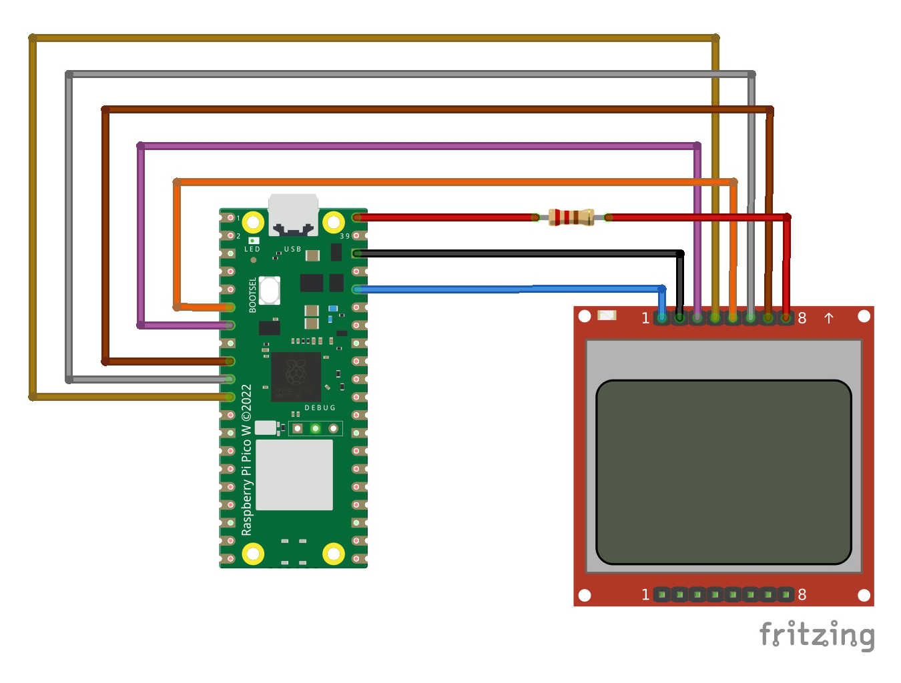

# PicoW_UDP_test
example on how to received UDP packet and display them on a LCD display

How to compile. 
The original folder was on ~/pico/udp_test

- mkdir build
- cd build
- cmake -DPICO_3BOARD=pico_w -DWIFI_SSID="MY_SSID" -DWIFI_PASSWORD="MY_PASSWORD" ..
   set ypur own wifi ssid and password
- make
- openocd -f interface/raspberrypi-swd.cfg -f target/rp2040.cfg -c "program udp_test.elf verify reset exit"

A small video about it
<a href="https://www.youtube.com/watch?v=ptX8b8zmi-E">Nokia and PicoW receiving UDP dat</a>
